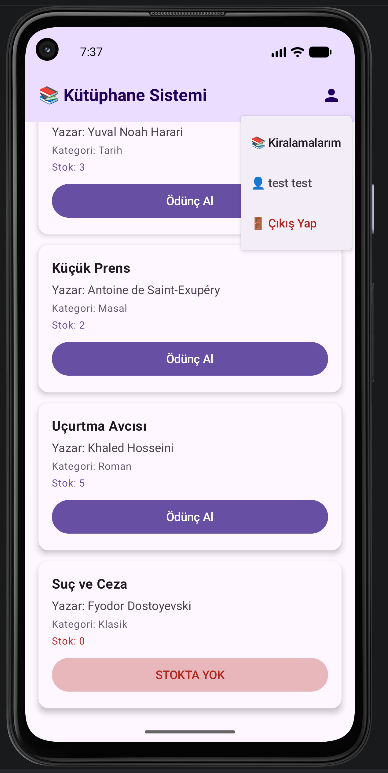
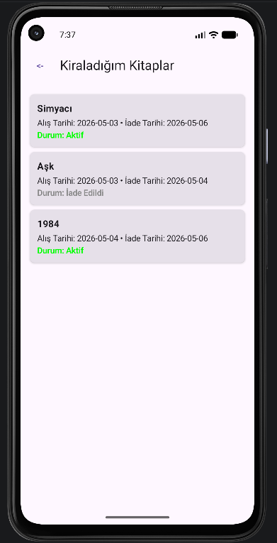

# Library App

Turkcell Kotlin Bootcamp kapsamında geliştirilmiş basit bir kütüphane yönetim uygulaması.  
Öğrenciler kitapları görüntüleyebilir, ödünç alabilir ve kiralama geçmişlerini listeleyebilir.

## Ekran Görüntüleri

|               Ana Sayfa                |              Kiraladığım kitaplar              |
| :------------------------------------: | :--------------------------------------------: |
|  |  |

## Kullanılan Teknolojiler

- **Kotlin** & **Jetpack Compose**
- **MVVM** mimarisi
- **Supabase** (Auth + PostgreSQL)
- **Kotlinx Serialization** & **Coroutines**

## Özellikler

- Kullanıcı kaydı ve girişi (e-posta / şifre)
- Kitap listesi ve stok takibi
- 1-5 gün arası ödünç alma (due date)
- Kullanıcının aktif ve geçmiş kiralamalarını listeleme
- Çıkış yapma

## Kurulum ve Çalıştırma

1. Projeyi klonlayın.
2. `local.properties` veya `BuildConfig` üzerinden Supabase URL ve anon anahtarınızı ekleyin.
3. Supabase projenizde gerekli tabloları (`books`, `profiles`, `borrow_records`) ve RLS politikalarını oluşturun.
4. Uygulamayı çalıştırın.
